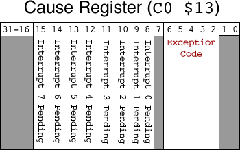

# CMPUT 229 Lab 4 - Countdown Timer

## Information

In this lab, you will learn about the coordination of asynchronous operations, such as interruptions, with the processor. Instead of using `syscall`s, in this assignment, you will handle all input and output using interruption handlers and memory-mapped device access. The only place where you will use `syscall`s in this lab is to print the prompt `Seconds=` and to read the integer value specifying the number of seconds to specify the start of the timer. All other display functions should be handled through your interruption handler and memory-mapped device access.

### Interrupts

Interrupts must be enabled in order to complete this project. To enable interrupts, set bit 0 of coprocessor 0's Status register (`$12`) to 1. The interruption mask in the status register also needs to be modified. Keyboards cause a level 1 interrupt, and the timer causes a level 5 interrupt. Setting bits 11 and 15 of the status register enables both interrupts.

Whenever an exception is raised or an interrupt occurs, the processor jumps to address `0x80000180`. Normally SPIM will place the default exception handler at that address. Therefore you need to turn off the default exception handler using the command line argument `-notrap`. To place your own handler at that address use the directive `.ktext 0x80000180` at the beginning of your handler code. Your handler can determine whether a timer interrupt or a keyboard interrupt occurred, and perform the appropriate operation before returning to your main code using `eret`, the MIPS Exception Return statement.

#### Timer

The MIPS architecture implements timing functionality in coprocessor 0, which is a convenient way to offload timing to another device. The processor is able to continue executing instructions until the coprocessor raises an interrupt when the specified quantity of time has elapsed. Only one timer can be running at a time, so it is the programmer's responsibility to reset recurring timers.

A timer function can be implemented using registers `$9` and `$11` of coprocessor 0. The value in register `$9` of coprocessor 0 is incremented every 10 ms. If the value reaches the maximum integer value, it resets to zero and continues incrementing. Whenever the values in register `$9` and the value in register `$11` become equal, a timer interruption is raised. These coprocessor 0 registers can be set using the instruction `mtc0 [local register], [coproc register]`, and read using `mfc0 [local register], [coproc register]`.

#### Cause Register

The cause of an exception can be found in register `$13` of coprocessor 0. It can be accessed using the instructions above, but it is not a register in the true sense, and should not be written to. As shown in the diagram below, only some fields are filled, and specifically bits `11` and `15` are useful for this assignment. Your exception handler needs to mask these bits out in order to determine whether the interrupt was caused by the timer or the keyboard.

<p align="center">
  
</p>

### Memory-Mapped IO

Memory-mapped IO allows interaction with external devices through an interface pretending to be system memory. This mapping allows the processor to communicate with these devices using the load-word and store-word instructions. Generally devices have 2 memory addresses associated with them, one acting as a control channel, which relays information about the device's state, and the other acting as a data channel, which relays data to and from a device. In order to enable memory-mapped IO in SPIM, the command line argument `-mapped_io` must be used.

The keyboard control register is mapped to address `0xffff 0000`. Set bit 1 to enable interrupts. When a keyboard interrupt occurs (i.e., a key is pressed), the hardware will set bit 0 of the control register.

The keyboard data register is mapped to address `0xffff 0004`. The ASCII keycode of the last character typed will be stored at this address in memory.

The display control register is mapped to address `0xffff 0008`. Your code should poll bit 0 (i.e., check it inside a loop) to see when the display is ready for output. The display will set bit 0 when it is ready for the next character.

The display data register is mapped to address `0xffff 000C`. When the display is ready for data, storing an ASCII code here will result in the corresponding character being written to the screen.

It makes sense to both read from and write to control registers. You will read bit 0 to see if a keyboard interrupt has occurred or the display is ready, and you will write bit 1 to enable interrupts. As for the data registers, it only makes sense to read the keyboard data register to retrieve the character that the user has typed, and it only makes sense to write the display data register, to output a character.

### The `__start` symbol

Looking through the examples provided, you will notice that in this lab you will need to the following directive:

```
.globl __start
```

This directive specifies that the symbol `__start` is globally visible. This symbol is required by the GNU linker to find out the exception handle starts. In the previous labs, you did not need to specify this symbol because SPIM loaded a default exception handler, which did specify this symbol before running your code. In this lab, you are replacing that default handler with your own.

## Assignment

Your assignment is to implement a countdown timer in MIPS assembly, that reads in a time in seconds, counts down that time to zero, and then quits. Without using any reading or printing `syscall`s, the timer must do all of the following:

*   Upon starting, display `Seconds=` on screen.
*   Allow the user to enter digits, showing them on-screen.
*   When the user presses enter, move to a new line and begin displaying the countdown timer with the following format: `mm:ss`. The timer must be updated in-place and not keep printing across the line or down lines.
*   When `q` is pressed, or when the timer reaches `00:00`, quit the application.
*   For all other key presses, do nothing.

Here is a method to do in-place updating of the text. In `xfce4-terminal`, the ASCII backspace character moves the cursor back, allowing you to write over previous characters. If you will be using a different terminal, you will need to specify which one your lab was tested with so the TAs can do the same. You will also need to run SPIM with the `-notrap` and `-mapped_io` arguments. For inspiration regarding the exception handler, we provide you with [exceptions.s](resources/code/exceptions.s), which is the default SPIM exception handler. You can use this file as a starting point.

## Resources

* Slides used for in-class introduction of the lab  ([.pdf](resources/slides/class.pdf))
* Slides used for in-lab introduction of the lab ([.pdf](resources/slides/lab.pdf))

## Marking Guide
Here is the [mark sheet](MarkSheet.txt) used for grading. Assignments that are too short to be adequately judged for code quality will be given a zero. In particular, your submission will be evaluated as follows:
* 20% for code cleanliness, readability, and comments
*  8% for proper startup and prompt
* 36% for proper response to keyboard input
* 36% for proper timing display (i.e., `mm:ss` in-place)

## Submission

There is a single file to be submitted for this lab. The file name should be `lab4.s`, and it should contain the code for both the interrupt handler and the `main` (i.e., your file must contain all the code for a successful countdown timer execution).

**Please make sure that you follow the link provided in the course eClass page for this lab assignment to get your own private GitHub repo for this lab. When prompted, make sure to link your GitHub account to your UAlberta ID, otherwise the teaching staff will not be able to grade your submission. If you do not recall whether or not you have previously linked your account, contact the teaching staff before the submission deadline.**

**To ensure that we have the latest version of your solution, make sure to commit your changes to the repo frequently. Otherwise, you may forget to commit your latest changes by the deadline (which will count as a late lab, and will not be graded). Your solution will be automatically collected via GitHub Classroom by the deadline.**

**Every file you commit to the repository MUST include the [CMPUT 229 Student Submission License](LICENSE.md) text at the very top, and you must include your name in the appropriate place in the license text. Make sure to comment out the license text if you are adding it to a code file (e.g., `lab4.s`), otherwise, your code will not compile or run. Failing to comply will render your submission inadmissible for grading.**
